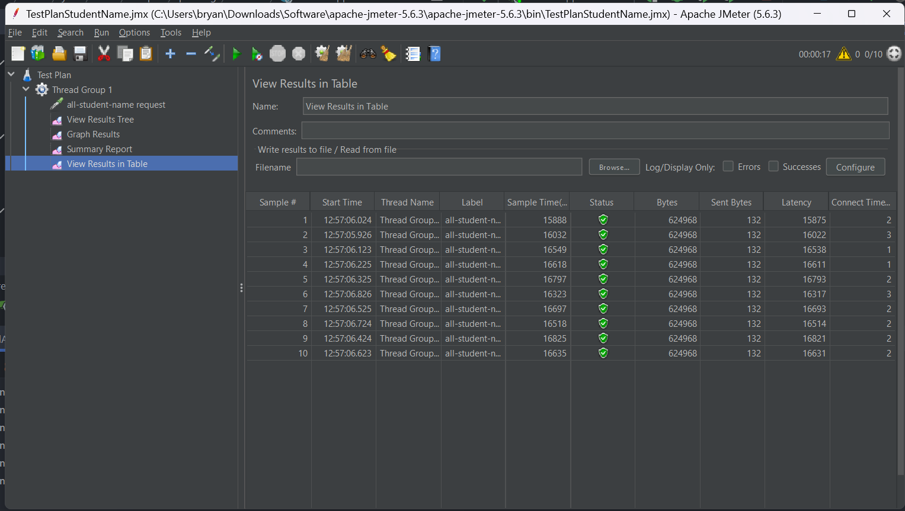

#  REFLECTION

## WEAK 5

### - /all-student

#### BEFORE

#### AFTER

There is a time improvement about 51%

### - /all-student-name
#### BEFORE

#### AFTER

There is a time improvement more than 90%

### - /highest-gpa

#### BEFORE

#### AFTER

There is a time improvement about 70%

### Conclusion
- There is an improvement for each method
- The method joinStudentNames() got the best time improvement (more than 90%)

### REFLECTION
1. What is the difference between the approach of performance testing with JMeter and
profiling with IntelliJ Profiler in the context of optimizing application performance?
[Source](https://stackoverflow.com/questions/9187942/performance-testing-vs-profiling)
The difference between these two tools is that JMeter simulates user load on an application to assess overall metrics (such as response time) under the simulation of real-world conditions. On the other hand, IntelliJ Profiler focuses on identifying specific code that consumes excessive memory or execution time within the app.

2. How does the profiling process help you in identifying and understanding the weak points
in your application?
[Source](https://granulate.io/blog/java-profiling-3-key-areas-profile/#:~:text=Java%20CPU%20profiling%20is%20the,the%20performance%20of%20your%20application.)
Profiling works by highlighting functions that are called frequently. Moreover, it also identifies objects that are instantiated multiple times. These two aspects serve as indicators of potential areas for refactoring.

3. Do you think IntelliJ Profiler is effective in assisting you to analyze and identify
bottlenecks in your application code?
Yes, IntelliJ Profiler is quite helpful. It highlights bottlenecks by identifying functions that are regularly called or consume the most resources. This helps me understand which functions need to be refactored. Additionally, it communicates its findings through visualization, making it easier for me to comprehend.

4. What are the main challenges you face when conducting performance testing and
profiling, and how do you overcome these challenges?
Since this is a new concept for me, I need some time to internalize the concepts of performance testing and profiling. I also have to understand step by step slowly to make sure I do the right thing. Moreover, refactoring also takes time. However, reading from various sources helps me understand the concepts better and assists in fixing bugs.

5. What are the main benefits you gain from using IntelliJ Profiler for profiling your
application code?
The IntelliJ Profiler specifically pinpoints the code parts that require optimization, eliminating any confusion about where to focus. Moreover, it facilitates comparison between the code before and after the changes are made.

6. How do you handle situations where the results from profiling with Inte lliJ Profiler are
not entirely consistent with findings from performance testing using JMeter?
To address that issue, I have to manually identify which part of the code is not really essential to be refactored. I have to make sure (for example, through algorithm analysis such as in DSA) whether the refactoring that I will implement will affect the whole code significantly or not.

7. What strategies do you implement in optimizing application code after analyzing results
from performance testing and profiling? How do you ensure the changes you make do
not affect the application's functionality?
First of all, I have to make sure that I fix the bottlenecks which are causing the resources (space/time) in the memory to be drained. After that, to address the issue of potential functionality change, I must follow the TDD principle, which forces me to ensure that the result of my code follows the expected output. These two steps are iterated until the expected time is achieved.

