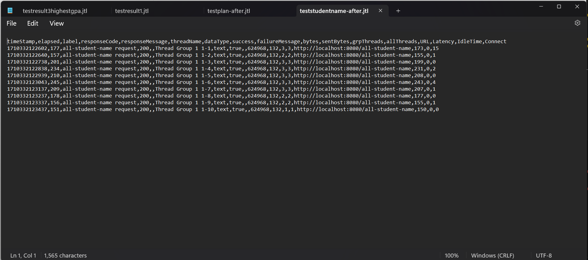

#  REFLECTION

## WEAK 5

### - /all-student

#### BEFORE

#### AFTER

There is a time improvement about 51%

### - /all-student-name
#### BEFORE

#### AFTER

There is a time improvement more than 90%

### - /highest-gpa

#### BEFORE

#### AFTER

There is a time improvement about 70%

### Conclusion
- There is an improvement for each method
- The method joinStudentNames() got the best time improvement (more than 90%)
